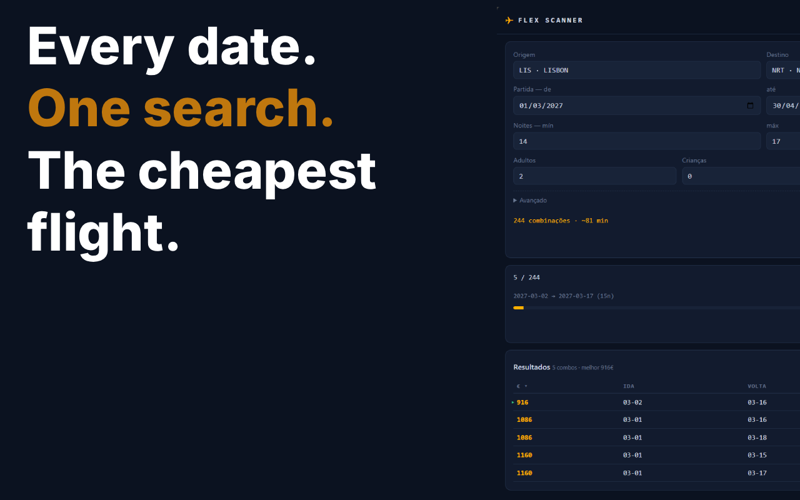

# ✈ eDreams Flex Scanner

**Find the cheapest flights across a flexible range of dates on eDreams.**

A Chrome extension that sweeps every departure/return combination
over a date range × nights range, opens each search in a real browser tab,
reads the "Cheapest" price straight from the page, and ranks the results in a
sortable table — with per-scan history and CSV export.

  

## Support me!

---

## Why

eDreams has no public API, and its result pages are protected by anti-bot
tooling that blocks direct requests. So instead of calling an API, this
extension drives a real browser: it navigates actual search tabs one at a time,
with randomised delays, and extracts the price the way a person would read it
off the screen. Slower than an API, but it works, and it uses your real
browser session.

## Features

- **Flexible date sweep** — pick a departure window (e.g. 1–20 Sept) and a
  nights range (e.g. 5–8), and it generates every valid round-trip combination.
- **Reads the real "Cheapest" price** — anchored on the page's own
  *Cheapest* / *Mais barato* tab, not a guessed selector, so it survives
  eDreams redesigns.
- **Self-correcting ETA** — estimates time remaining from measured per-search
  timings, not a fixed guess.
- **Fast stabilisation** — jumps to the next search as soon as the price
  confirms across a few readings, tunable in Advanced.
- **Anti-bot aware** — sequential tabs, randomised 8–15 s delays, and automatic
  pause with a warning if a CAPTCHA is detected.
- **Passengers** — adults, children, and infants.
- **Search history** — every completed scan is saved with its results; reopen
  any past scan.
- **CSV export** and a **sortable results table** (price, out, back, nights,
  airline).
- **EN / PT** interface with a language switcher.

## Install

### Chrome Web Store

### From source

1. Download or clone this repository.
2. Open `chrome://extensions` and turn on **Developer mode**.
3. Click **Load unpacked** and select the project folder.
4. Click the extension icon to open the side panel.
   
## First run

1. Fill in origin, destination, and one date, then click **Search**.
2. If the tab opens the correct results page, you're set. 

## How it works

| File            | World    | Role |
|-----------------|----------|------|
| `content.js`    | ISOLATED | Reads the *Cheapest* tab from the page, pushes the stabilised price to the panel, detects anti-bot pages. |
| `sidepanel.js`  | Panel    | Builds the queue, runs it sequentially with delays, renders results, ETA, history, CSV. |
| `background.js` | SW       | Opens the side panel on icon click. |

The queue runs in the side panel (not the service worker), because MV3 service
workers are suspended after ~30 s of inactivity, which would kill a sweep with
8–15 s delays between tabs. **Keep the panel open while a scan runs.**

## Known limitations

- **The price is the Prime (discounted) price** on routes that have Prime,
  because that's what the *Cheapest* tab shows. If you're not a Prime member,
  checkout will be higher.
- **No parallelism.** 60–80 combinations take ~12–15 minutes. Sequential
  scanning is what keeps you from getting blocked.
- If eDreams changes its front end, the URL template or the *Cheapest* selector
  in `content.js` may need adjusting.
- The panel must stay open for the duration of a scan.

## Disclaimer

This is a personal tool for personal use. It automates a browser to read
publicly visible prices; it does not bypass authentication or access private
data. Respect eDreams' terms of service. Use at your own risk.

## License

MIT © [Lucas Canero](https://github.com/lucascanero)
